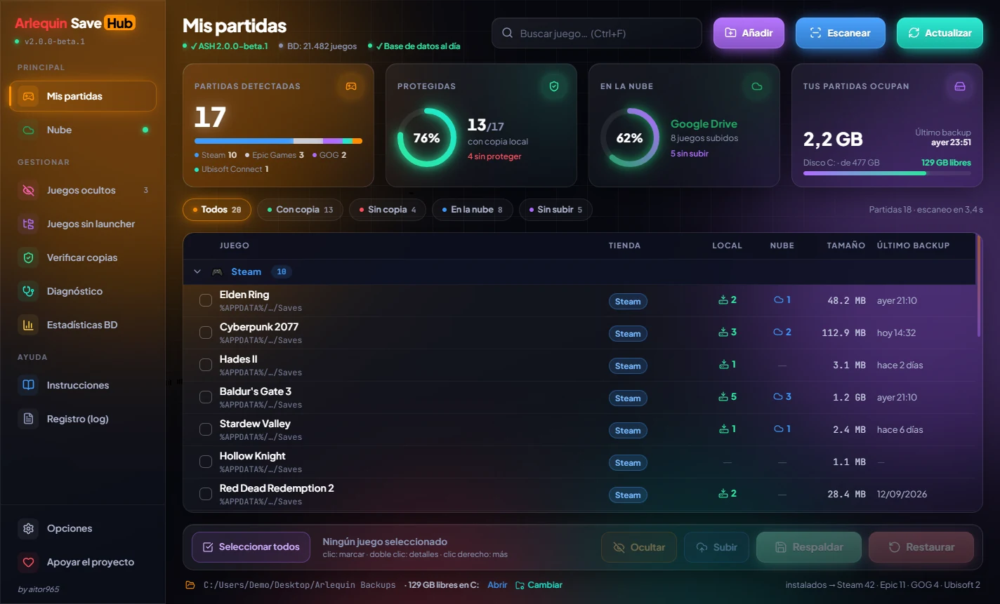

# 🎮 Arlequin SaveHub (ASH)

**Arlequin SaveHub (ASH)** es una herramienta gratuita y de código abierto
para Windows que localiza, protege y restaura las partidas guardadas y los
datos locales de tus juegos de PC.

> **Que perder una partida guardada deje de ser un problema.**

-   🌐 Web oficial: https://arlequinsavehub.com
-   📦 Descargas: https://github.com/aitor965/Arlequin-SaveHub/releases/latest
-   🐞 Problemas y sugerencias: https://github.com/aitor965/Arlequin-SaveHub/issues
-   ✉️ Contacto: arlequinsavehub@gmail.com

------------------------------------------------------------------------

# ✨ Qué hace

-   🔎 **Detecta tus juegos** consultando Steam, Epic, GOG, Battle.net,
    Ubisoft Connect, EA app, Amazon Games y Xbox / Microsoft Store, y
    también juegos sin launcher (portables, itch.io, DRM-free...).
-   🗃️ **Sabe dónde guarda cada juego** gracias a ArlequinGameDB, una base
    propia con más de 50.000 juegos.
-   💾 **Copias de seguridad versionadas**: la copia actual y un historial
    con fecha, con el máximo de copias por juego que elijas.
-   🗝️ **Partidas en el registro de Windows**: también respalda los juegos
    que guardan en el registro (clásicos y muchos juegos Unity).
-   ♻️ **Restauración segura**: vista previa, comprobación de integridad y
    copia "↩️ Antes de restaurar" para poder deshacer.
-   🔐 **Integridad SHA-256** de cada copia (`ash_backup.json`).
-   ☁️ **Nube: Google Drive, OneDrive o Dropbox**: subida y descarga de
    copias, con varias copias por juego y subidas reanudables. ASH solo
    accede a su propia carpeta.
-   ⏱️ **Automático**: respaldos cada X horas/días/semanas o al cerrar el
    juego, con detección de crash para no guardar un save dañado.
-   🧰 Inicio con Windows, bandeja del sistema y avisos.

------------------------------------------------------------------------

# 🚀 Arlequin SaveHub 2.0 (beta)



La 2.0 estrena una **interfaz completamente nueva**, oscura y con los colores
de Arlequin, hecha con pywebview + React. Por dentro usa **el mismo motor que
la 1.1.9**: mismos datos, misma configuración y misma carpeta de backups, así
que puedes probarla y volver a la 1.1.9 cuando quieras.

-   ✦ **Ventana nueva:** tarjetas de resumen con anillos de progreso
    (partidas, protegidas, en la nube y lo que ocupan), tabla por tiendas
    con filtros de un clic, orden por columnas, búsqueda y clic derecho.
-   ⛁ **Espacio libre** del disco donde está la carpeta de backups.
-   ☁️ **Nube con color:** Google Drive verde, OneDrive azul cielo y Dropbox
    azul intenso; subir, descargar y sincronizar desde un panel.
-   ⚙️ **Opciones rediseñadas** en pestañas (General, Local y Nube).
-   🪟 La ventana se adapta a la pantalla donde se abre y la barra de título
    es oscura en Windows 10 y 11.

📦 Descarga: [Arlequin_SaveHub_2.0_beta.exe](https://github.com/aitor965/Arlequin-SaveHub/releases/download/v2.0.0-beta.2/Arlequin_SaveHub_2.0_beta.exe)
(pre-release; la versión estable sigue siendo la 1.1.9). El código está en
[`ASH-2.0/`](ASH-2.0/).

------------------------------------------------------------------------

# 🆕 Novedades de la versión 1.1.9

### 🖥️ Ventana principal nueva
-   **Tabla con columnas**: tienda, copias locales, copias en la nube,
    tamaño, último backup y detalle. Haz clic en un título para ordenar.
-   **Grupos plegables** por tienda; ASH recuerda cuáles cerraste. Los
    apartados informativos empiezan plegados.
-   **Buscador y filtro**: con copia local, sin copia local, en la nube o
    sin subir a la nube.
-   **Clic derecho** en un juego: respaldar, restaurar, abrir la carpeta del
    save o del backup, subir a la nube, detalles, diagnóstico, verificar su
    copia y ocultar. **Doble clic**: detalles.
-   Menos filas de botones (siguen siendo de colores 🎨) y un menú
    **☰ Más** con el resto de herramientas.
-   La ventana es más ancha, para que se lean las rutas completas, y
    **recuerda su tamaño y posición**.
-   Nuevo logo: Arlequin **Save**`Hub`.
-   Junto a la versión de la base de datos se ve cuántos juegos tiene.

### ☁️ Nube más ligera
-   El índice de copias se guarda en caché: si nada ha cambiado, basta una
    petición pequeña. Abrir la ventana ☁ Nube ya no hace peticiones.
-   El índice solo se sube cuando hay algo nuevo (antes se reescribía en
    cada sincronización y hacía que los demás PCs lo volvieran a descargar).
-   Caché de huellas: los backups que no cambian no se vuelven a leer.

### 🛠️ Correcciones importantes
-   Con **una sola copia local**, el nombre del juego salía con el
    indicador `[💾 1 local]` y el siguiente backup de algunos juegos podía ir
    a una carpeta con ese nombre. Está corregido y, al arrancar, ASH junta
    esas carpetas con la buena (la más reciente queda como actual y la otra
    como histórico con fecha).
-   La comprobación rápida del índice de la nube no llegaba a funcionar
    nunca.

------------------------------------------------------------------------

# Novedades de la versión 1.1.8

### ☁️ Tres nubes para elegir
-   Además de **Google Drive**, ahora puedes guardar tus copias en
    **OneDrive** o en **Dropbox**. Se elige al conectar en la ventana
    **☁ Nube** (una nube a la vez).
-   ASH solo puede usar su propia carpeta (`Aplicaciones/Arlequin SaveHub`
    en OneDrive y Dropbox; los archivos que crea él en Google Drive). No
    puede ver el resto de tus archivos.
-   Todo funciona igual en las tres: subir, sincronizar, descargar eligiendo
    la copia, máximo de copias por juego y subidas que continúan donde se
    quedaron.

### 🔓 Google Drive para todos
-   La app de Google ya está publicada: no hace falta pedir acceso y la
    conexión no caduca cada semana.

### 🛠️ Correcciones
-   Si la nube confirmaba solo una parte de un bloque, la subida podía
    continuar desde un punto equivocado.

------------------------------------------------------------------------

# Novedades de la versión 1.1.7

### 🗝️ Registro de Windows
-   Los juegos que guardan la partida en `HKEY_CURRENT_USER` se detectan,
    se respaldan (como archivos `.reg`) y se restauran como cualquier otro.
-   Se detectan aunque ningún launcher los conozca.
-   Al restaurar solo se importan claves de ese juego; si algo falla, el
    registro queda como estaba.

### 📋 Lista principal
-   Cada juego muestra cuántas copias tiene: **`[💾 3 locales]`** y
    **`[☁ 2 en nube]`**.
-   Barras de desplazamiento y textos de estado que ya no se pisan.
-   Un backup ya asociado a un juego no se repite en "Solo en carpeta backup".

### ♻️ Restaurar
-   Al descargar de la nube puedes **elegir qué copia** quieres si hay
    varias (doble clic para cambiarla).
-   Lo que había en el PC antes de restaurar se guarda como
    **"↩️ Antes de restaurar"** junto a tus backups, en vez de quedarse
    dentro de las carpetas del juego.
-   "🕐 Reciente" restaura siempre el último backup.

### ⚙️ Opciones reorganizadas
Ahora están en tres bloques: **General** arriba, **💾 Local** a la izquierda
y **☁ Nube** a la derecha. Opciones nuevas:
-   Comprobar si hay una versión nueva al iniciar.
-   Mostrar u ocultar juegos sin save conocido, juegos a la espera de su
    primer uso y juegos 100% online.
-   Avisos de tareas automáticas: Nunca / Solo errores / Siempre.
-   Comprobar la integridad de las copias cada semana.
-   No copiar archivos o carpetas (`*.log; *.tmp; ShaderCache`...).
-   Guardar o no la copia "Antes de restaurar".
-   No subir a la nube mientras **OBS esté abierto** (grabando o
    transmitiendo; ya no hace falta configurar OBS WebSocket).

### ⚡ Rendimiento y fiabilidad
-   Búsqueda de saves **entre 4 y 6 veces más rápida**.
-   `config.json` se guarda de forma atómica y sin conflictos entre tareas.
-   Correcciones: backups que podían cortarse al comprobar el espacio libre,
    restauración de juegos con varias rutas, `ash_backup.json` que se
    quedaba en la carpeta del juego y comprobación de tamaño de las copias.
-   Actualizador más seguro: comprueba que la descarga está completa y, si
    `version.json` incluye `sha256`, verifica la huella del ejecutable.

### ❤️ Donaciones
-   Nueva ventana "Apoya Arlequin SaveHub" con PayPal y GitHub Sponsors.

------------------------------------------------------------------------

# 🗃️ ArlequinGameDB v1.4

ASH utiliza su propia base de datos, `ArlequinGameDB.yaml`, que se
descarga y actualiza sola desde este repositorio.

| Dato | Cantidad |
|---|---|
| Juegos totales | 50.240 |
| Con ubicación de guardado conocida | 21.458 |
| … de ellos, en el registro de Windows | 340 |
| Con ruta probable de Steam Cloud | 2.245 |
| Identificados, sin ruta conocida todavía | 26.537 |
| Con acrónimos / nombres alternativos | 10.814 |

Novedades de la v1.4:

-   Más de 31.000 juegos nuevos procedentes de Ludusavi Manifest (de 18.809
    a 50.240), con sus IDs de Steam y GOG, tiendas y acrónimos.
-   Claves de registro de los juegos que guardan ahí la partida.
-   Solo rutas de Windows: se han quitado las de Linux, macOS, Lutris y
    Flatpak.
-   Rutas corregidas: `LocalLow` mal ubicado, `AppData/Local/Local` y
    SteamID escritos a mano.

Formato de cada ficha:

``` yaml
- name: Nombre del juego
  ids:
    steam: 123456
    gog: 1234567890
  stores: [steam, gog]
  save_locations:
  - <winAppData>/Estudio/Juego [os=windows, store=steam]
  registry:
  - HKEY_CURRENT_USER/Software/Estudio/Juego
  acronyms: Juego, JG
```

Fuentes y atribuciones: Ludusavi Manifest, PCGamingWiki y Steam API.

------------------------------------------------------------------------

# 📖 Cómo utilizar ASH

1.  Descarga `Arlequin_SaveHub.exe` desde
    [Releases](https://github.com/aitor965/Arlequin-SaveHub/releases/latest)
    y ábrelo.
2.  La primera vez, elige dónde guardar los backups.
3.  Espera a que termine el escaneo.
4.  Selecciona los juegos y pulsa **Respaldar Save(s)** o
    **Restaurar Save(s)**.
5.  En **☁ Nube** conecta tu Google Drive, OneDrive o Dropbox si quieres
    copias fuera del PC. En **⚙️ Opciones** puedes activar los respaldos
    automáticos, las subidas a la nube y el resto de opciones.

Consejo: cierra el juego antes de respaldar o restaurar.

### Aviso de Windows SmartScreen

Es posible que al abrir `Arlequin_SaveHub.exe` Windows muestre el aviso
**"Windows protegió su PC"**.
Aparece con los programas nuevos que todavía no tienen firma digital ni
suficientes descargas para que Windows los conozca; no significa que el
programa tenga nada malo.

Para abrirlo: pulsa **Más información** → **Ejecutar de todas formas**.

Si quieres comprobar que el archivo es el original, compara su huella
SHA-256 con la publicada en las notas de cada
[Release](https://github.com/aitor965/Arlequin-SaveHub/releases). En
PowerShell:

``` powershell
Get-FileHash .\Arlequin_SaveHub.exe -Algorithm SHA256
```

Huella de la v1.1.9:
`c03199b0553c69e16764bc8f49a2f3ea65f79e5641be137c0e3ddc746087c069`

El código es abierto y el `.exe` se compila automáticamente desde este
repositorio con GitHub Actions.

**Firma de código (en trámite):** se ha solicitado la firma gratuita para
Windows de [SignPath.io](https://about.signpath.io/), con certificado de
[SignPath Foundation](https://signpath.org/). Cuando se apruebe, los `.exe`
saldrán firmados y el aviso de SmartScreen irá desapareciendo.

------------------------------------------------------------------------

# 🔮 Futuras mejoras

-   Más cobertura de juegos y más rutas confirmadas.
-   Diferenciar mejor los juegos con progreso local, online o solo
    configuración.
-   Separar el programa en módulos para facilitar su mantenimiento.

------------------------------------------------------------------------

# 🤝 Contribuciones

El proyecto acepta mejoras relacionadas con:

-   Nuevos juegos, rutas de guardado y claves de registro.
-   Correcciones de datos e identificadores.
-   Mejoras de detección.

Abre un [issue](https://github.com/aitor965/Arlequin-SaveHub/issues) o un
pull request.

------------------------------------------------------------------------

# ❤️ Apoya Arlequin SaveHub

Arlequin es gratuito y open source. Si te resulta útil, puedes ayudar a
seguir mejorándolo y manteniendo la base de datos:

-   💙 PayPal: https://www.paypal.me/ArlequinSaveHub
-   ⭐ GitHub Sponsors: https://github.com/sponsors/aitor965

Gracias por apoyar el proyecto ❤️

------------------------------------------------------------------------

# 📜 Licencia, privacidad y créditos

-   [Política de privacidad](https://arlequinsavehub.com/privacy-policy.html)
-   [Términos de uso](https://arlequinsavehub.com/terms-of-service.html)

El **código de Arlequin SaveHub** es software libre bajo la licencia
[GNU GPL v3.0](LICENSE) (o posterior): puedes usarlo, estudiarlo, modificarlo y
redistribuirlo, pero cualquier versión modificada que distribuyas debe
publicarse también con la GPL-3.0 y con su código fuente.
© 2026 aitor965.

**ArlequinGameDB** (`ArlequinGameDB.yaml`) se distribuye bajo
[CC BY-NC-SA 3.0](https://creativecommons.org/licenses/by-nc-sa/3.0/deed.es),
la misma licencia que PCGamingWiki, de donde proceden sus datos. Incluye datos
de Ludusavi Manifest (licencia MIT, © 2020 Matthew T. Kennerly). Detalles,
atribuciones y aviso completo en [LICENSE-DATABASE.md](LICENSE-DATABASE.md).
ASH es una adaptación independiente orientada a Windows.

**Arlequin SaveHub (ASH)** · by aitor965
